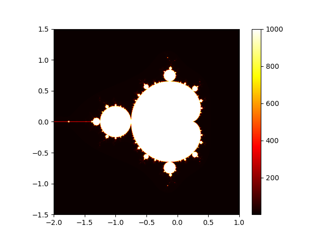
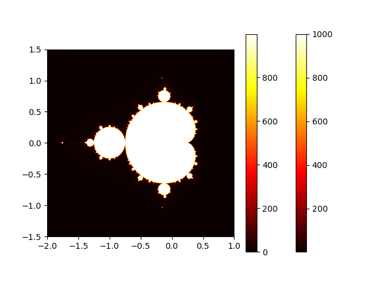

# Mandelbrot Set Generation Results

## Non-Vectorized Method

Execution time: 16489.96 ms
The non-vectorized method iterates over each pixel individually, which can be slow for large images.

## Vectorized Method

Execution time: 7419.67 ms
The vectorized method leverages numpy's array operations to perform computations on entire arrays at once, significantly speeding up the process.
