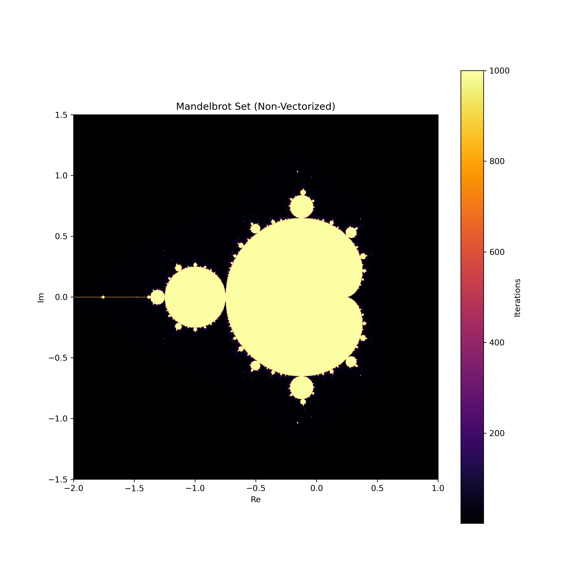
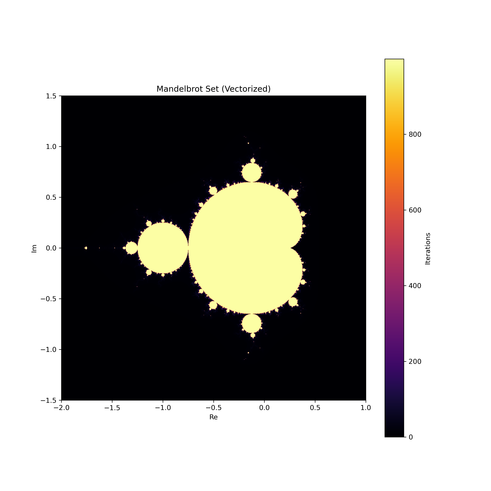

# Mandelbrot Set Generation Results

## Overview
This project demonstrates the generation of the Mandelbrot set using both non-vectorized and vectorized approaches. The Mandelbrot set is a set of complex numbers \(c\) for which the function \(f_c(z) = z^2 + c\) does not diverge when iterated from \(z = 0\). The boundary of the Mandelbrot set is a fractal, and its visualization is a popular example of mathematical beauty in complex dynamics.

## Non-Vectorized Method

**Execution time**: 14149.31 ms
The non-vectorized method iterates over each pixel individually, which can be slow for large images. In this method, each pixel corresponds to a complex number, and the algorithm iteratively applies the function \(f_c(z) = z^2 + c\) until the magnitude of \(z\) exceeds 2 or the maximum number of iterations is reached. This process is computationally intensive as it does not leverage vectorized operations.

## Vectorized Method

**Execution time**: 7210.51 ms
The vectorized method leverages numpy's array operations to perform computations on entire arrays at once, significantly speeding up the process. In this approach, the same iterative function \(f_c(z) = z^2 + c\) is applied, but numpy arrays are used to handle multiple points simultaneously, thus optimizing the computation. This method is much faster for large images as it takes advantage of low-level optimizations in numpy.

## Analysis
The images above visualize the Mandelbrot set using both methods. Despite the differences in implementation, the output images should be visually identical, depicting the fractal nature of the Mandelbrot set. The execution time, however, highlights the efficiency gains from using vectorized operations. The non-vectorized method, being more straightforward and easier to understand, serves as a baseline, whereas the vectorized method demonstrates the power of numpy for numerical computations.

### Key Observations
- **Performance**: The vectorized method is significantly faster due to its use of numpy arrays for parallel computations.
- **Implementation Complexity**: The non-vectorized method is simpler to implement but less efficient.
- **Output**: Both methods produce the same visual output, confirming the correctness of the implementation.

### Mathematical Background
The Mandelbrot set is defined by the set of complex numbers \(c\) for which the sequence defined by the iteration \(z_{n+1} = z_n^2 + c\) remains bounded. Mathematically, this means that there exists a positive integer \(N\) such that for all \(n > N\), \(|z_n| \leq 2\). If \(|z_n| > 2\) for any iteration, the sequence will escape to infinity, and \(c\) is not in the Mandelbrot set.

### LaTeX Formulas
- Iterative function: \(f_c(z) = z^2 + c\)
- Condition for boundedness: \(|z_n| \leq 2\)
By comparing the execution times and observing the generated images, this project highlights the benefits of vectorization in numerical computing and the beauty of fractal geometry.
