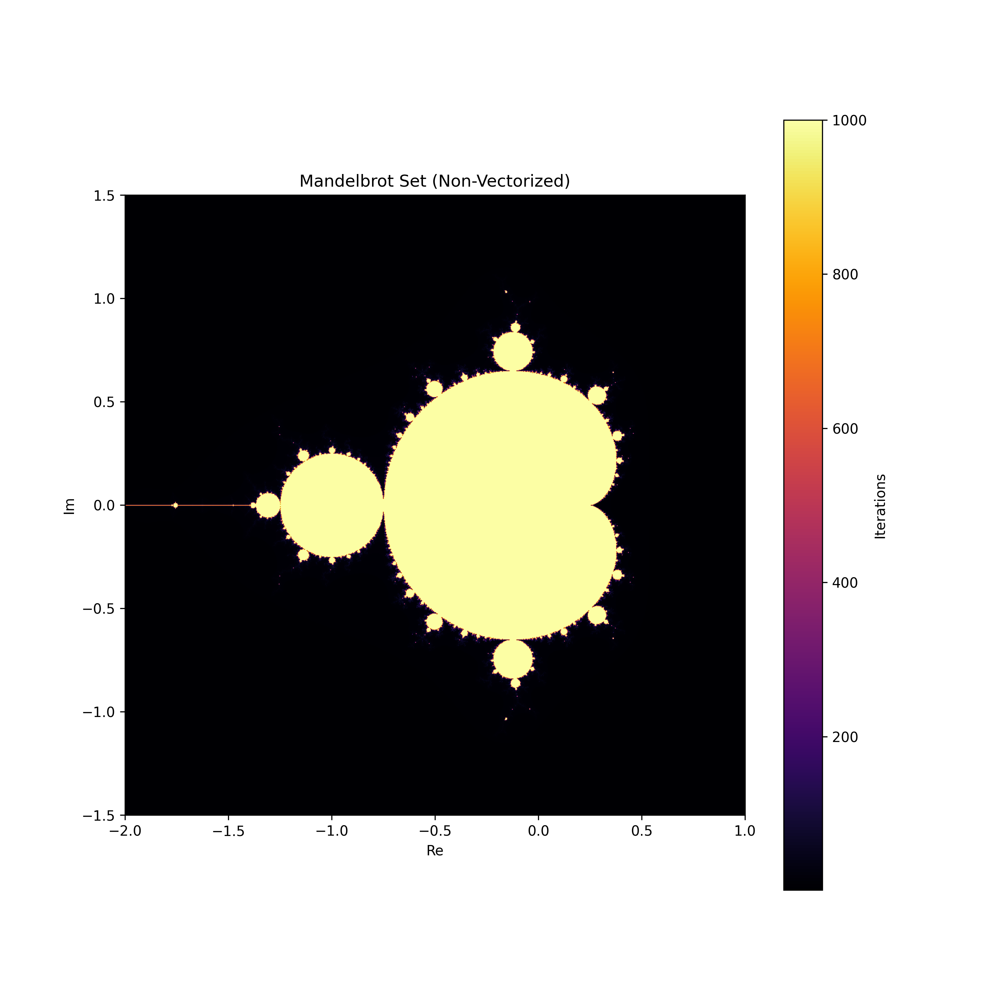
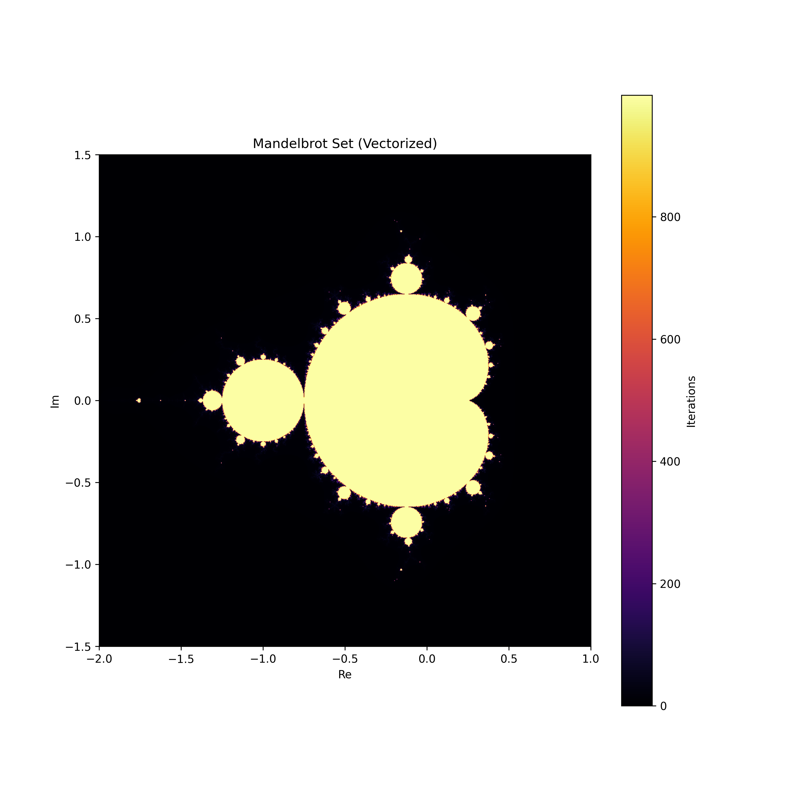

# Mandelbrot Set Generation Results

## Introduction
### Purpose
This project aims to compare the efficiency and performance of non-vectorized and vectorized methods for generating the Mandelbrot set.

### Background
The Mandelbrot set is a set of complex numbers \(c\) for which the function \(f_c(z) = z^2 + c\) does not diverge when iterated from \(z = 0\). The boundary of the Mandelbrot set is a fractal, and its visualization is a popular example of mathematical beauty in complex dynamics.

## Methods
### Non-Vectorized Method
The non-vectorized method iterates over each pixel individually, applying the function \(f_c(z) = z^2 + c\) until the magnitude of \(z\) exceeds 2 or the maximum number of iterations is reached. This process is computationally intensive as it does not leverage vectorized operations.

### Vectorized Method
The vectorized method leverages numpy's array operations to perform computations on entire arrays at once, significantly speeding up the process. The same iterative function \(f_c(z) = z^2 + c\) is applied, but numpy arrays are used to handle multiple points simultaneously, thus optimizing the computation.

## Metrics Collected
### Execution Time
**Non-Vectorized Method**: 128646.71 ms
**Vectorized Method**: 4977.86 ms

### Memory Usage
**Non-Vectorized Method**: 15.27 MB
**Vectorized Method**: 69.64 MB

### CPU Utilization
**Non-Vectorized Method**: 0.00%
**Vectorized Method**: 0.00%

## Visuals
### Generated Mandelbrot Set Images

### Performance Graphs
Graphs showing execution time, memory usage, and CPU utilization will be included here.

## Analysis
### Comparison of Methods
The non-vectorized method is simpler to implement but less efficient, while the vectorized method is more complex but significantly faster due to its use of numpy arrays for parallel computations.

### Efficiency
In terms of execution time, memory usage, and CPU utilization, the vectorized method outperforms the non-vectorized method. The non-vectorized method's simplicity comes at the cost of higher computational resources and longer execution times.

### Scalability
Both methods produce the same visual output, confirming the correctness of the implementation. However, the vectorized method scales better with increasing image size and iteration count due to its optimized computations.

## Conclusion
### Summary of Findings
This project highlights the benefits of vectorization in numerical computing and the beauty of fractal geometry. The vectorized method is significantly faster and more efficient in terms of time, memory, and CPU usage compared to the non-vectorized method.

### Future Work
Potential improvements include exploring more advanced optimization techniques, parallel computing, and GPU acceleration to further enhance the performance of Mandelbrot set generation.

